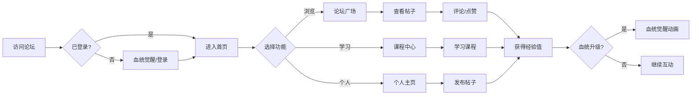

## 1. 产品概述

卡塞尔学院守夜人论坛是一个以龙族小说世界观为核心的多人在线交互平台。平台以"血统等级"为核心成长体系，用户通过发布帖子、评论互动、点赞等行为获取经验值，提升血统等级。整体设计风格深度还原龙族小说的暗黑奇幻美学，营造神秘的学院氛围。

- **目标用户**: 龙族小说粉丝、奇幻文学爱好者
- **核心价值**: 沉浸式龙族世界观体验、血统成长体系、社区互动

## 2. 核心功能

### 2.1 用户角色与血统等级
| 血统等级 | 经验值范围 | 称号 | 特权 |
|----------|------------|------|------|
| S级 | 10000+ | 龙王 | 专属徽章、高级课程解锁 |
| A级 | 5000-9999 | 执行部专员 | 发布活动、管理权限 |
| B级 | 2000-4999 | 高级学员 | 专属课程、自定义主页 |
| C级 | 500-1999 | 正式学员 | 评论、点赞、发布帖子 |
| D级 | 0-499 | 新生 | 浏览内容、基础课程 |

### 2.2 功能模块
1. **首页**: 守夜人公告、热门帖子、血统排行榜、今日任务
2. **课程中心**: 言灵课程、炼金术课程、格斗课程、历史课程
3. **论坛广场**: 帖子列表、分类筛选、搜索功能
4. **帖子详情**: 内容展示、评论区、点赞收藏
5. **个人主页**: 个性化装扮、血统展示、发帖记录、成就徽章
6. **登录/注册**: 学员认证、血统觉醒

### 2.3 页面详情
| 页面名称 | 模块名称 | 功能描述 |
|----------|----------|----------|
| 首页 | 守夜人公告 | 系统公告、活动通知、龙族世界观文字 |
| 首页 | 热门帖子 | 高热度帖子展示、评论数、点赞数 |
| 首页 | 血统排行榜 | 经验值排名、血统等级展示 |
| 首页 | 今日任务 | 每日任务列表、经验值奖励 |
| 课程中心 | 课程分类 | 言灵、炼金术、格斗、历史四大课程 |
| 课程中心 | 课程详情 | 课程内容、学习进度、评论互动 |
| 论坛广场 | 帖子列表 | 分类标签、热度排序、时间排序 |
| 论坛广场 | 发帖编辑 | 标题、内容、标签选择 |
| 帖子详情 | 内容区 | 帖子正文、作者信息、发布时间 |
| 帖子详情 | 评论区 | 多级评论、回复功能、点赞 |
| 个人主页 | 血统展示 | 血统等级、经验值进度、成就徽章 |
| 个人主页 | 个性化装扮 | 主页背景、头像框、签名档 |
| 个人主页 | 发帖记录 | 历史帖子、收藏帖子 |
| 登录注册 | 认证页面 | 学员编号、密码、血统觉醒动画 |

## 3. 核心流程

### 3.1 用户注册登录流程
访问首页 → 点击"血统觉醒"(注册) → 填写学员信息 → 血统检测动画 → 进入个人主页

### 3.2 经验值获取流程
| 行为 | 经验值奖励 | 每日上限 |
|------|------------|----------|
| 发布帖子 | +20经验 | 100 |
| 发布评论 | +5经验 | 50 |
| 获得点赞 | +2经验/次 | 无上限 |
| 点赞他人 | +1经验/次 | 20 |
| 完成课程 | +50经验 | 无上限 |
| 每日签到 | +10经验 | 10 |

### 3.3 流程图

## 4. 用户界面设计

### 4.1 设计风格
- **主色调**: 深邃黑(#0D0D0D) + 血红(#8B0000) + 金色(#D4AF37)
- **辅助色**: 龙鳞灰(#2A2A2A)、暗紫(#4A0E4E)、冰蓝(#00CED1)
- **字体**: 标题使用 "Cinzel"(哥特风)，正文使用 "Noto Sans SC"
- **布局风格**: 暗黑系卡片布局，龙鳞纹理背景，金色边框装饰
- **图标风格**: 龙族元素图标(龙鳞、言灵符号、炼金术符号)

### 4.2 视觉元素
- **背景**: 暗黑渐变 + 龙鳞纹理 + 微光粒子效果
- **卡片**: 半透明玻璃态效果，金色细边框
- **按钮**: 血红渐变，悬停发光效果
- **动画**: 血统觉醒时的龙焰特效、经验值增加的粒子飘散

### 4.3 页面设计概览
| 页面名称 | 模块名称 | UI元素 |
|----------|----------|--------|
| 首页 | Hero区域 | 卡塞尔学院大门背景、守夜人徽章、暗黑氛围 |
| 首页 | 血统排行 | 龙形边框、血统等级徽章、经验值条 |
| 论坛广场 | 帖子卡片 | 龙鳞纹理背景、血红标题、金色标签 |
| 帖子详情 | 评论区 | 暗色气泡、血统徽章、时间戳 |
| 个人主页 | 血统展示 | 龙焰光环、经验值进度环、成就徽章墙 |
| 登录注册 | 觉醒动画 | 龙形剪影、血色光芒、粒子爆发 |

### 4.4 响应式设计
- **桌面端**: 完整功能展示，多栏布局，沉浸式体验
- **平板端**: 自适应两栏布局
- **移动端**: 单列布局，底部导航栏

### 4.5 动效设计
- 页面加载：龙焰燃烧过渡效果
- 血统升级：全屏龙焰爆发动画
- 经验值增加：金色粒子飘向经验条
- 点赞效果：血红心形粒子扩散
- 评论发送：暗影波动效果

## 5. 特色功能

### 5.1 血统觉醒系统
- 新用户注册时播放"血统检测"动画
- 根据用户名生成随机血统初始值
- 血统升级时播放专属觉醒动画

### 5.2 言灵技能展示
- 不同血统等级解锁不同言灵技能图标
- 个人主页展示已觉醒的言灵

### 5.3 守夜人任务
- 每日任务系统，完成任务获取经验
- 周常任务，更高经验奖励

## 6. 性能指标
- 页面加载时间 < 2秒
- 动画流畅运行 60fps
- 支持多用户同时在线互动
- 评论实时更新