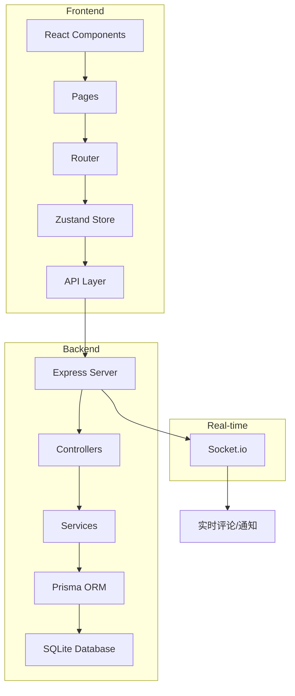
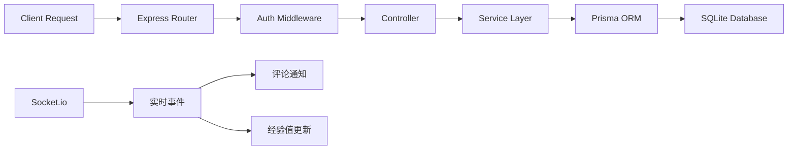
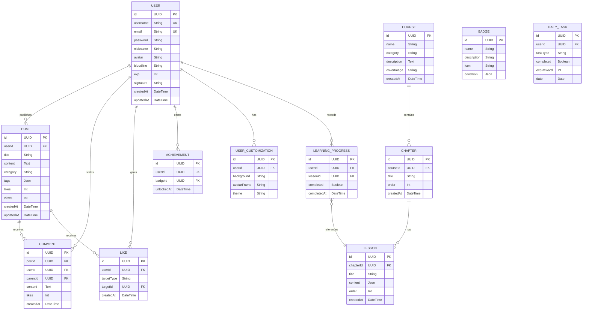

## 1. 架构设计



## 2. 技术选型

- **前端**: React@18 + TypeScript + Vite
- **样式**: TailwindCSS@3 + Framer Motion (动画)
- **状态管理**: Zustand
- **路由**: React Router DOM
- **实时通信**: Socket.io-client
- **图标**: Lucide React
- **后端**: Express@4 + TypeScript
- **数据库**: SQLite (开发) / PostgreSQL (生产)
- **ORM**: Prisma
- **认证**: JWT + bcrypt
- **实时服务**: Socket.io

## 3. 路由定义

| 路由 | 页面组件 | 功能描述 |
|------|----------|----------|
| / | Home | 首页，公告、热门帖子、排行榜 |
| /courses | Courses | 课程中心，课程列表 |
| /courses/:id | CourseDetail | 课程详情页 |
| /forum | Forum | 论坛广场，帖子列表 |
| /forum/new | NewPost | 发布新帖子 |
| /forum/:id | PostDetail | 帖子详情，评论区 |
| /profile | Profile | 个人主页 |
| /profile/:id | UserProfile | 他人主页 |
| /login | Login | 登录页面 |
| /register | Register | 注册页面(血统觉醒) |

## 4. API定义

### 4.1 用户认证
| 方法 | 路径 | 描述 |
|------|------|------|
| POST | /api/auth/register | 用户注册 |
| POST | /api/auth/login | 用户登录 |
| GET | /api/auth/me | 获取当前用户 |
| PUT | /api/auth/profile | 更新个人资料 |

### 4.2 帖子
| 方法 | 路径 | 描述 |
|------|------|------|
| GET | /api/posts | 获取帖子列表 |
| GET | /api/posts/:id | 获取帖子详情 |
| POST | /api/posts | 发布帖子 |
| PUT | /api/posts/:id | 更新帖子 |
| DELETE | /api/posts/:id | 删除帖子 |
| POST | /api/posts/:id/like | 点赞帖子 |

### 4.3 评论
| 方法 | 路径 | 描述 |
|------|------|------|
| GET | /api/posts/:id/comments | 获取评论列表 |
| POST | /api/posts/:id/comments | 发表评论 |
| DELETE | /api/comments/:id | 删除评论 |
| POST | /api/comments/:id/like | 点赞评论 |

### 4.4 课程
| 方法 | 路径 | 描述 |
|------|------|------|
| GET | /api/courses | 获取课程列表 |
| GET | /api/courses/:id | 获取课程详情 |
| POST | /api/courses/:id/progress | 记录学习进度 |

### 4.5 经验值与血统
| 方法 | 路径 | 描述 |
|------|------|------|
| GET | /api/ranking | 获取血统排行榜 |
| POST | /api/exp/signin | 每日签到 |
| GET | /api/tasks | 获取今日任务 |

## 5. 服务器架构图



## 6. 数据模型

### 6.1 ER图



### 6.2 DDL语句

```sql
CREATE TABLE users (
    id VARCHAR(36) PRIMARY KEY,
    username VARCHAR(50) UNIQUE NOT NULL,
    email VARCHAR(255) UNIQUE NOT NULL,
    password VARCHAR(255) NOT NULL,
    nickname VARCHAR(50) NOT NULL,
    avatar VARCHAR(255),
    bloodline VARCHAR(10) DEFAULT 'D',
    exp INTEGER DEFAULT 0,
    signature VARCHAR(255),
    created_at TIMESTAMP DEFAULT CURRENT_TIMESTAMP,
    updated_at TIMESTAMP DEFAULT CURRENT_TIMESTAMP
);

CREATE TABLE user_customizations (
    id VARCHAR(36) PRIMARY KEY,
    user_id VARCHAR(36) REFERENCES users(id),
    background VARCHAR(255),
    avatar_frame VARCHAR(100),
    theme VARCHAR(50) DEFAULT 'dark',
    created_at TIMESTAMP DEFAULT CURRENT_TIMESTAMP
);

CREATE TABLE posts (
    id VARCHAR(36) PRIMARY KEY,
    user_id VARCHAR(36) REFERENCES users(id),
    title VARCHAR(200) NOT NULL,
    content TEXT NOT NULL,
    category VARCHAR(50) NOT NULL,
    tags JSON,
    likes INTEGER DEFAULT 0,
    views INTEGER DEFAULT 0,
    created_at TIMESTAMP DEFAULT CURRENT_TIMESTAMP,
    updated_at TIMESTAMP DEFAULT CURRENT_TIMESTAMP
);

CREATE TABLE comments (
    id VARCHAR(36) PRIMARY KEY,
    post_id VARCHAR(36) REFERENCES posts(id) ON DELETE CASCADE,
    user_id VARCHAR(36) REFERENCES users(id),
    parent_id VARCHAR(36) REFERENCES comments(id),
    content TEXT NOT NULL,
    likes INTEGER DEFAULT 0,
    created_at TIMESTAMP DEFAULT CURRENT_TIMESTAMP
);

CREATE TABLE likes (
    id VARCHAR(36) PRIMARY KEY,
    user_id VARCHAR(36) REFERENCES users(id),
    target_type VARCHAR(20) NOT NULL,
    target_id VARCHAR(36) NOT NULL,
    created_at TIMESTAMP DEFAULT CURRENT_TIMESTAMP,
    UNIQUE(user_id, target_type, target_id)
);

CREATE TABLE courses (
    id VARCHAR(36) PRIMARY KEY,
    name VARCHAR(100) NOT NULL,
    category VARCHAR(50) NOT NULL,
    description TEXT,
    cover_image VARCHAR(255),
    created_at TIMESTAMP DEFAULT CURRENT_TIMESTAMP
);

CREATE TABLE chapters (
    id VARCHAR(36) PRIMARY KEY,
    course_id VARCHAR(36) REFERENCES courses(id),
    title VARCHAR(100) NOT NULL,
    "order" INTEGER NOT NULL,
    created_at TIMESTAMP DEFAULT CURRENT_TIMESTAMP
);

CREATE TABLE lessons (
    id VARCHAR(36) PRIMARY KEY,
    chapter_id VARCHAR(36) REFERENCES chapters(id),
    title VARCHAR(100) NOT NULL,
    content JSON NOT NULL,
    "order" INTEGER NOT NULL,
    created_at TIMESTAMP DEFAULT CURRENT_TIMESTAMP
);

CREATE TABLE learning_progress (
    id VARCHAR(36) PRIMARY KEY,
    user_id VARCHAR(36) REFERENCES users(id),
    lesson_id VARCHAR(36) REFERENCES lessons(id),
    completed BOOLEAN DEFAULT FALSE,
    completed_at TIMESTAMP,
    UNIQUE(user_id, lesson_id)
);

CREATE TABLE badges (
    id VARCHAR(36) PRIMARY KEY,
    name VARCHAR(50) NOT NULL,
    description VARCHAR(255),
    icon VARCHAR(100),
    condition JSON NOT NULL
);

CREATE TABLE achievements (
    id VARCHAR(36) PRIMARY KEY,
    user_id VARCHAR(36) REFERENCES users(id),
    badge_id VARCHAR(36) REFERENCES badges(id),
    unlocked_at TIMESTAMP DEFAULT CURRENT_TIMESTAMP,
    UNIQUE(user_id, badge_id)
);

CREATE TABLE daily_tasks (
    id VARCHAR(36) PRIMARY KEY,
    user_id VARCHAR(36) REFERENCES users(id),
    task_type VARCHAR(50) NOT NULL,
    completed BOOLEAN DEFAULT FALSE,
    exp_reward INTEGER DEFAULT 0,
    date DATE NOT NULL,
    UNIQUE(user_id, task_type, date)
);

CREATE INDEX idx_posts_category ON posts(category);
CREATE INDEX idx_posts_created_at ON posts(created_at DESC);
CREATE INDEX idx_comments_post_id ON comments(post_id);
CREATE INDEX idx_users_exp ON users(exp DESC);
```

## 7. 经验值系统设计

### 7.1 血统等级计算
```typescript
function calculateBloodline(exp: number): string {
  if (exp >= 10000) return 'S';
  if (exp >= 5000) return 'A';
  if (exp >= 2000) return 'B';
  if (exp >= 500) return 'C';
  return 'D';
}

function getNextLevelExp(exp: number): { current: number; next: number; needed: number } {
  const levels = [0, 500, 2000, 5000, 10000];
  const currentLevel = levels.findIndex((l, i) => exp >= l && (i === levels.length - 1 || exp < levels[i + 1]));
  const nextLevel = Math.min(currentLevel + 1, levels.length - 1);
  return {
    current: exp,
    next: levels[nextLevel],
    needed: levels[nextLevel] - exp
  };
}
```

### 7.2 经验值获取规则
| 行为 | 经验值 | 每日上限 | 触发条件 |
|------|--------|----------|----------|
| 发布帖子 | +20 | 100 | 帖子发布成功 |
| 发布评论 | +5 | 50 | 评论发布成功 |
| 获得点赞 | +2 | 无上限 | 他人点赞 |
| 点赞他人 | +1 | 20 | 点赞成功 |
| 完成课程 | +50 | 无上限 | 课程完成 |
| 每日签到 | +10 | 10 | 首次签到 |

## 8. 项目结构

```
cassel-forum/
├── src/
│   ├── components/
│   │   ├── common/
│   │   ├── layout/
│   │   ├── post/
│   │   ├── comment/
│   │   └── bloodline/
│   ├── pages/
│   │   ├── Home.tsx
│   │   ├── Forum.tsx
│   │   ├── PostDetail.tsx
│   │   ├── Courses.tsx
│   │   ├── Profile.tsx
│   │   ├── Login.tsx
│   │   └── Register.tsx
│   ├── store/
│   │   ├── userStore.ts
│   │   ├── postStore.ts
│   │   └── notificationStore.ts
│   ├── hooks/
│   ├── services/
│   ├── types/
│   └── utils/
├── api/
│   ├── controllers/
│   ├── services/
│   ├── middleware/
│   ├── routes/
│   ├── prisma/
│   └── utils/
├── shared/
│   └── types.ts
├── package.json
└── vite.config.ts
```

## 9. Socket.io 事件设计

| 事件名 | 方向 | 数据 | 描述 |
|--------|------|------|------|
| new_comment | Server→Client | { postId, comment } | 新评论通知 |
| exp_update | Server→Client | { exp, bloodline } | 经验值更新 |
| bloodline_upgrade | Server→Client | { oldLevel, newLevel } | 血统升级 |
| like_notification | Server→Client | { from, target } | 点赞通知 |

## 10. 安全考虑

- JWT 认证，7天过期
- 密码 bcrypt 加密
- 评论/帖子内容 XSS 过滤
- API 请求频率限制
- 敏感操作二次验证